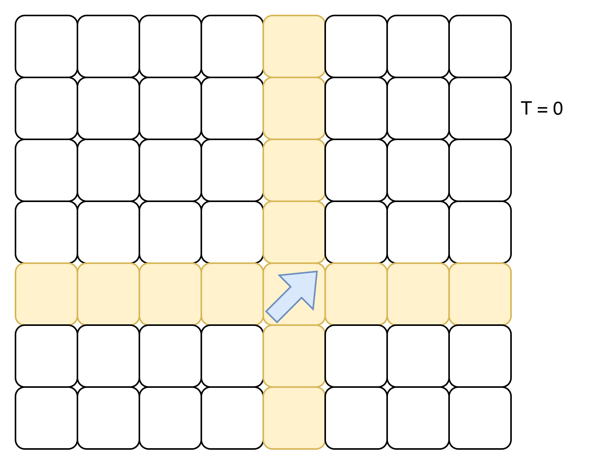
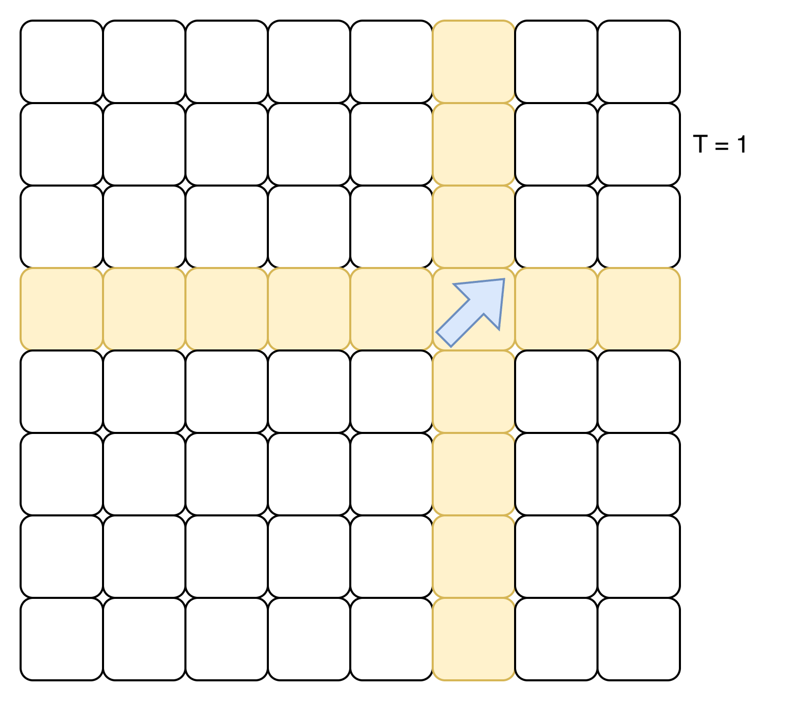
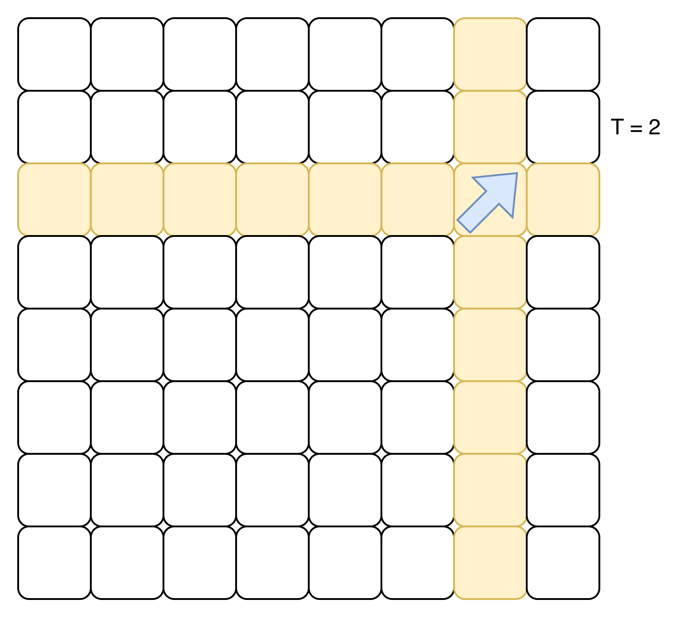
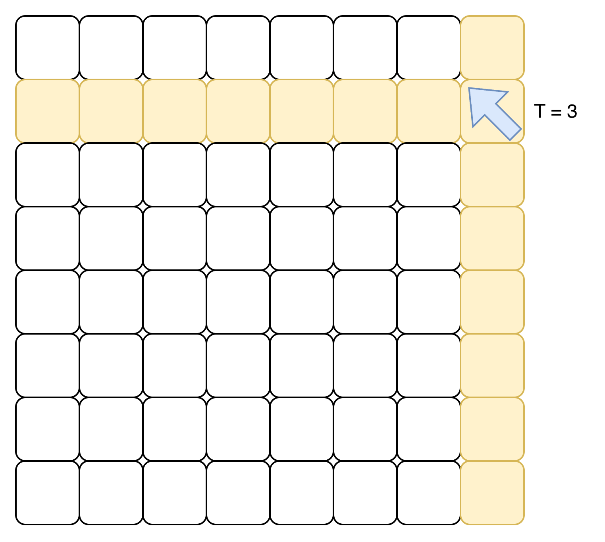
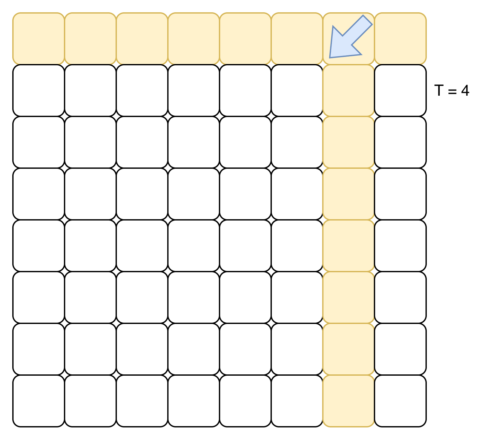
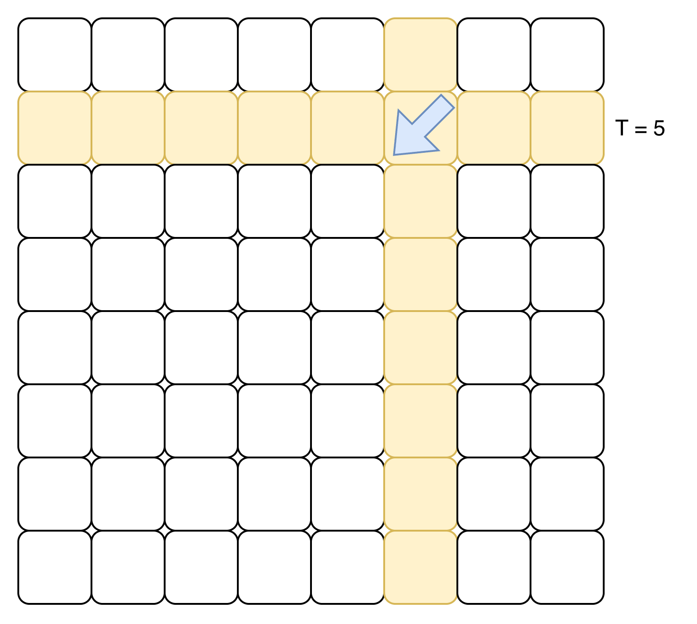

# Historia

Un **robot aspiradora** se quedó atascado: en lugar de barrer normalmente, se mueve **rebotando** por la sala como si fuera una pelotita de pong.

La sala es una cuadrícula de $N$ filas (numeradas $1$ a $N$ de arriba abajo) y $M$ columnas (numeradas $1$ a $M$ de izquierda a derecha). El robot empieza en la celda $(r_b, c_b)$. Cada segundo se mueve por $(dr, dc)$ filas y columnas, donde **al inicio** $dr = 1$ y $dc = 1$.

Antes de cada movimiento:

- Si el robot está pegado a una pared **horizontal** (arriba o abajo) y avanzar lo sacaría de la sala, **invierte** el signo de $dr$.
- Si el robot está pegado a una pared **vertical** (izquierda o derecha) y avanzar lo sacaría de la sala, **invierte** el signo de $dc$.

En cada segundo (incluyendo el segundo $0$, **antes** del primer movimiento), el robot **limpia toda la fila y toda la columna** donde está parado. Solamente hay una celda sucia en la sala, ubicada en $(r_d, c_d)$.

A continuación se muestra cómo se va moviendo un robot durante los segundos $0$ a $5$ dentro de una sala de $8 \times 8$. Las **cuadrículas amarillas** son las que el robot limpia en ese segundo.

# Problema

Calcula en qué **segundo** la celda sucia es limpiada por primera vez.

# Entrada

Una única línea con seis enteros separados por espacios: $N$, $M$, $r_b$, $c_b$, $r_d$, $c_d$.

# Salida

Un único entero: el segundo en el que la celda sucia es limpiada por primera vez.

# Ejemplos

||input
10 10 6 1 2 8
||output
7
||description
El robot va rebotando por la sala. En el segundo $7$ pasa por la fila $2$ (donde está la celda sucia) y la limpia.
||input
10 10 9 9 1 1
||output
10
||input
2 2 1 1 2 1
||output
0
||description
En el segundo $0$, antes de moverse, el robot ya limpia toda la fila $1$ (donde está). La celda sucia $(2,1)$ no está en la fila $1$... pero **sí está en la columna $1$**, que también limpia. Por eso la respuesta es $0$.
||end

# Limites

- $1 \leq N, M \leq 10^9$
- $1 \leq r_b, r_d \leq N$
- $1 \leq c_b, c_d \leq M$
- Se garantiza que el robot eventualmente limpia la celda sucia.

**Para un 50% de los casos**

- $1 \leq N, M \leq 100$
