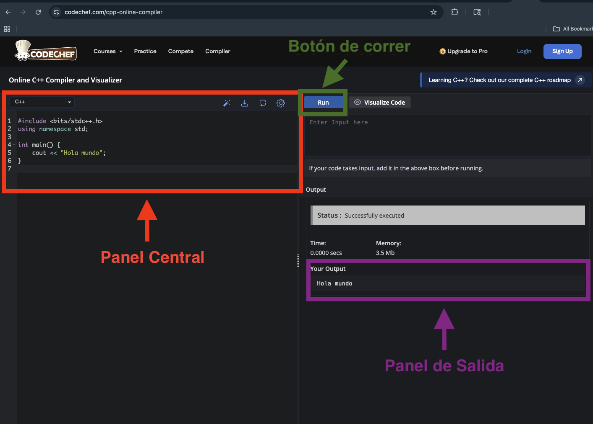

Esta es una **lectura** diseñada para el curso de la OMI Yucatán. El curso tiene como propósito enseñar los principios básicos de programación competitiva en C++.

# CodeChef: editor en línea con visualizador

Entra a: **https://www.codechef.com/cpp-online-compiler**

La pantalla tiene tres partes principales:



- **Panel central:** donde escribes tu código.
- **Botón de correr:** ejecuta el programa.
- **Panel de salida:** donde aparece el resultado.

## Corre tu primer programa

Borra el código que viene por default y escribe este:

```cpp
#include <bits/stdc++.h>
using namespace std;

int main() {
    cout << "Hola Mundo";
    return 0;
}
```

Da clic en **Run**. Debe aparecer:

```
Hola Mundo
```

¡Listo! Eso es un programa corriendo.

## ¿Por qué CodeChef?

CodeChef tiene una función extra muy útil: un **visualizador paso a paso**. Te permite ver tu programa ejecutándose línea por línea y observar cómo cambian las variables en cada momento.

Esto ayuda mucho cuando algo no sale como esperabas y no entiendes por qué. Lo veremos en detalle en una lectura posterior del curso.

Por ahora solo necesitas saber que **Run** corre el programa completo.
