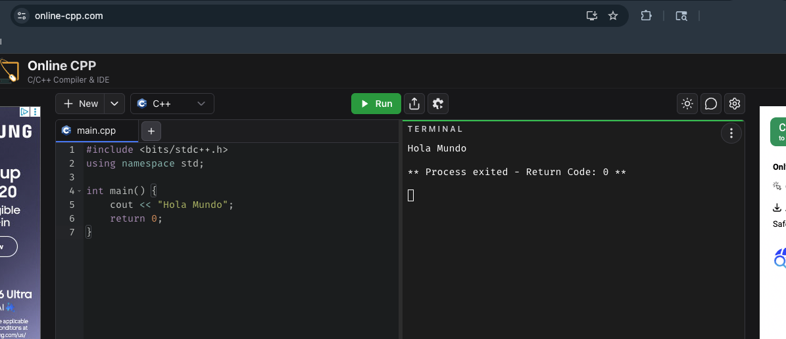
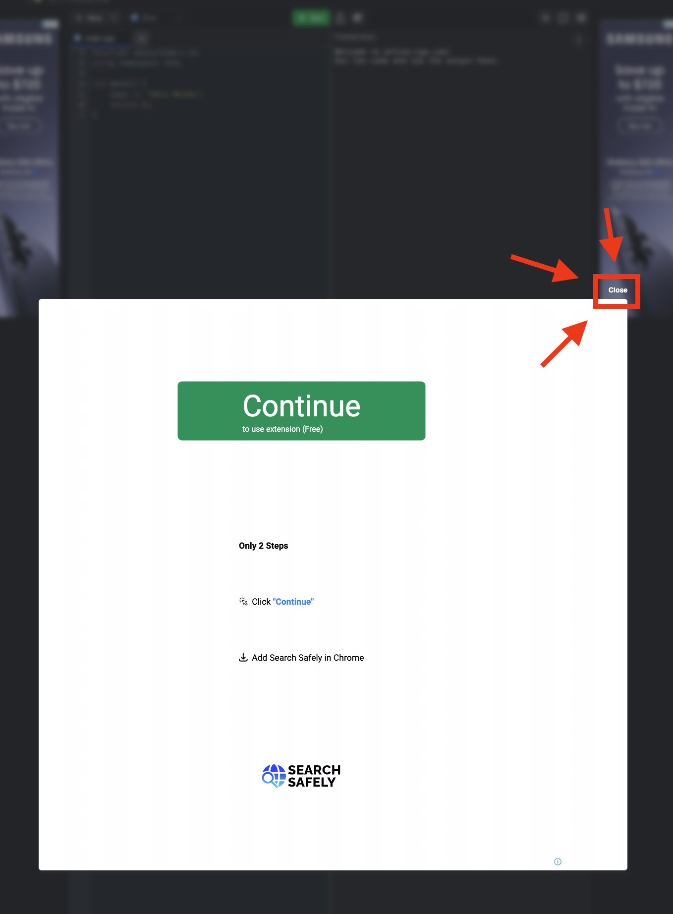

Esta es una **lectura** diseñada para el curso de la OMI Yucatán. El curso tiene como propósito enseñar los principios básicos de programación competitiva en C++.

# online-cpp: el más sencillo

Entra a: **https://www.online-cpp.com/**

Verás una pantalla dividida en dos partes:



- **Izquierda:** donde escribes tu código.
- **Derecha:** donde aparece el resultado.

## Corre tu primer programa

El editor ya trae un código de ejemplo. Bórralo todo y escribe exactamente esto:

```cpp
#include <bits/stdc++.h>
using namespace std;

int main() {
    cout << "Hola Mundo";
    return 0;
}
```

Da clic en **Run**. En el panel derecho debe aparecer:

```
Hola Mundo
```

¡Listo! Eso es un programa corriendo.

## Si algo salió mal

- **No aparece nada / error rojo:** revisa que copiaste el código tal cual — una letra de más, un `;` de menos o una llave `{}` que falta son suficientes para que falle.
- **La página no carga:** prueba CodeChef o el compilador de OmegaUp de las siguientes lecturas.

## Anuncios

De vez en cuando te aparecera un anuncio que te bloquea toda la pantalla. Ignoralo y cierralo.

