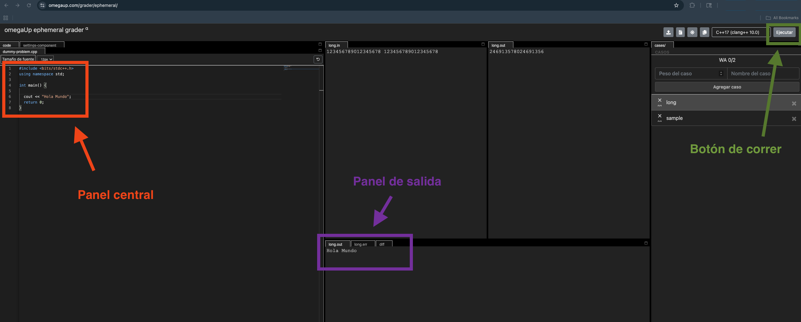
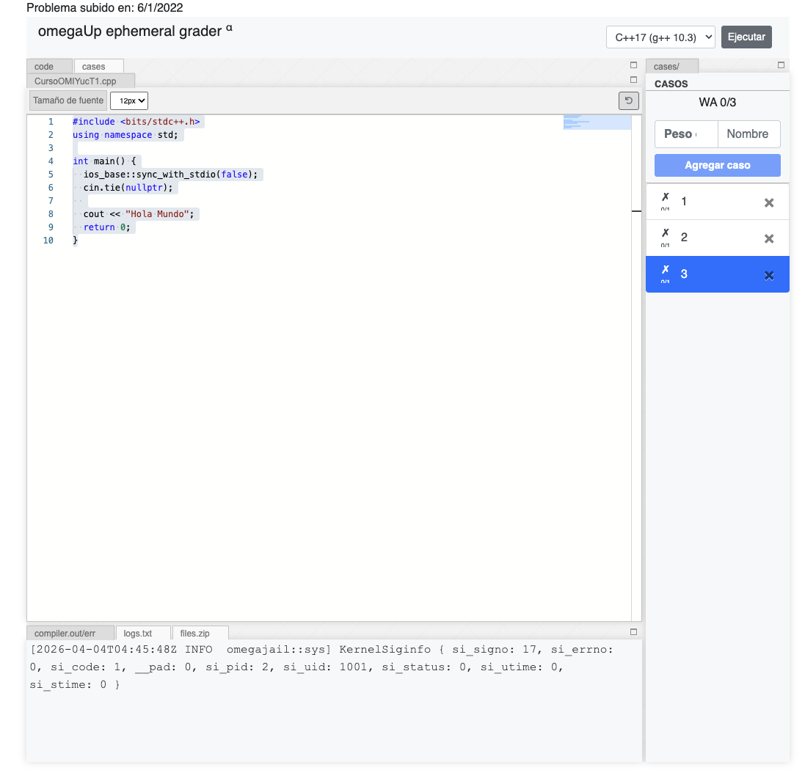

Esta es una **lectura** diseñada para el curso de la OMI Yucatán. El curso tiene como propósito enseñar los principios básicos de programación competitiva en C++.

# Compilador de OmegaUp

OmegaUp tiene su propio compilador integrado que puedes usar para probar código rápido sin salir de la plataforma. Se llama **ephemeral grader** y vive dentro de la página de cualquier problema o puedes acceder a el mediante https://omegaup.com/grader/ephemeral/.

Esta opción es útil una vez que estés en el flujo de resolver problemas — pero tiene bastantes botones y opciones que al principio no necesitas. En esta lectura te mostramos qué partes ignorar.

## Cómo acceder

La pantalla se ve compleja, pero por ahora solo necesitas tres cosas:



1. **Panel central:** (panel izquierdo) — aquí escribes tu programa.
2. **Botón de correr:** (arriba a la derecha) — corre tu código.
3. **Panel de salida:** (panel inferior derecho, pestaña `long.out`) — aquí aparece el resultado.

Todo lo demás — casos de prueba, pesos, configuraciones — lo puedes ignorar por completo por ahora.

## Probarlo con Hola Mundo

En el editor ya viene un código de ejemplo. Bórralo y escribe:

```cpp
#include <bits/stdc++.h>
using namespace std;

int main() {
    cout << "Hola Mundo";
    return 0;
}
```

Da clic en **Ejecutar**. En la pestaña `long.out` del panel inferior debe aparecer:

```
Hola Mundo
```

## Accediendo dentro de un problema

La parte positiva de este editor de texto es que lo encontraras dentro de cada problema (no lectura) al ir bajando a la parte de abajo.

