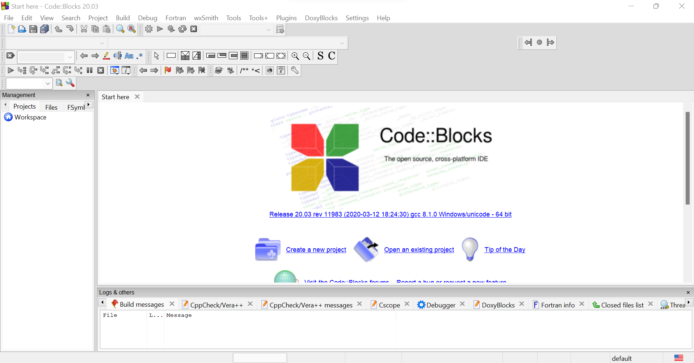
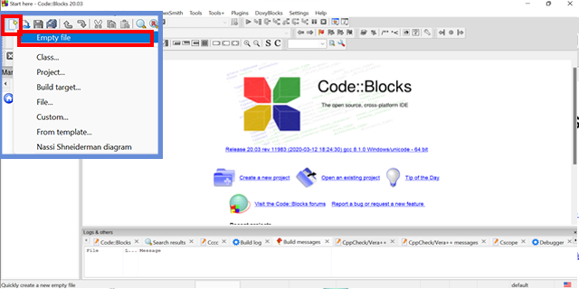
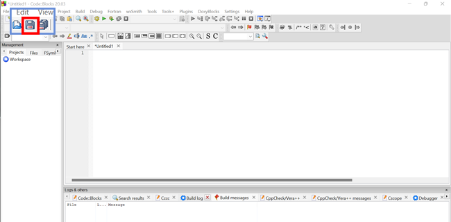
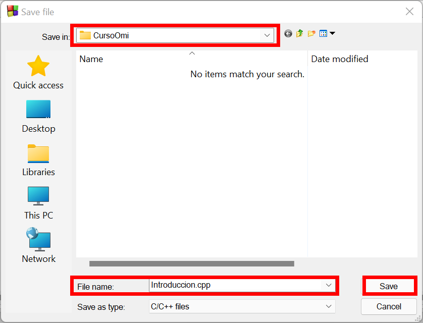
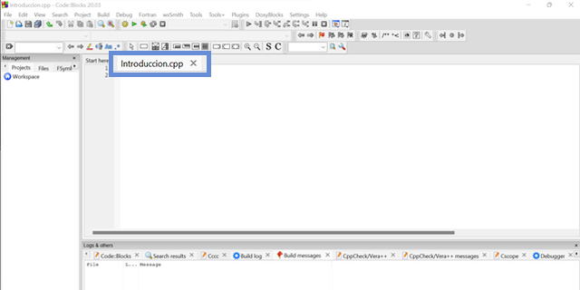
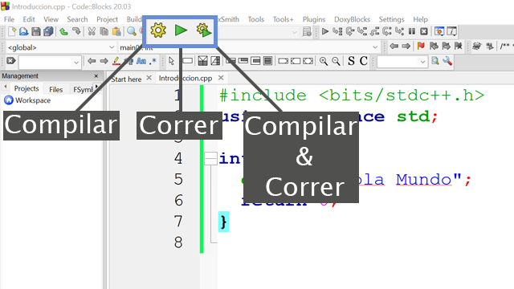

Esta es una **lectura** diseñada para el curso de la OMI Yucatán. El curso tiene como propósito enseñar los principios básicos de programación competitiva en C++.

# CodeBlocks: editor instalado en tu computadora

CodeBlocks es un editor que se instala en tu computadora. Una vez instalado no necesitas internet para programar.

**Esta opción es opcional.** Si los editores en línea te funcionan bien, puedes saltarte esta lectura por ahora.

## Instalación

Descarga CodeBlocks desde su página oficial. Busca la versión que incluye el compilador (`codeblocks-XX.XXmingw-setup.exe` en Windows). Sigue el instalador con las opciones por default.

## Crear tu primer archivo

**Paso 1 — Abrir CodeBlocks**



**Paso 2 — Crear un archivo en blanco**

Menú Archivo → Nuevo → Archivo vacío.



**Paso 3 — Guardar el archivo**

Guárdalo con **Ctrl+S**. Ponle el nombre que quieras, pero agrega `.cpp` al final — sin esa extensión no lo reconoce como C++.





Si lo guardaste bien, verás el nombre en la barra superior.



## Corre tu primer programa

Escribe este código en el archivo:

```cpp
#include <bits/stdc++.h>
using namespace std;

int main() {
    cout << "Hola Mundo";
    return 0;
}
```

Da clic en el botón de **compilar y correr** (triángulo verde con engrane). Aparecerá una ventana negra con `Hola Mundo`.



Si la ventana se cierra muy rápido, es normal — los programas de este curso terminan solos cuando acaban de ejecutarse.
