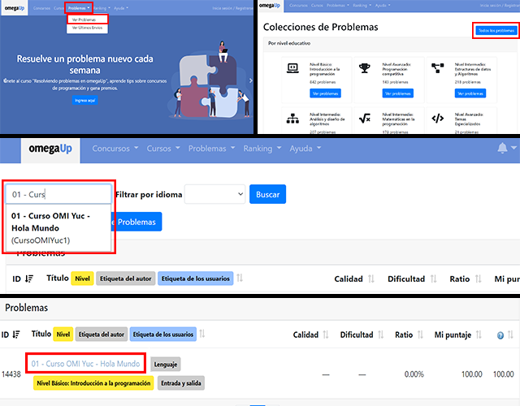
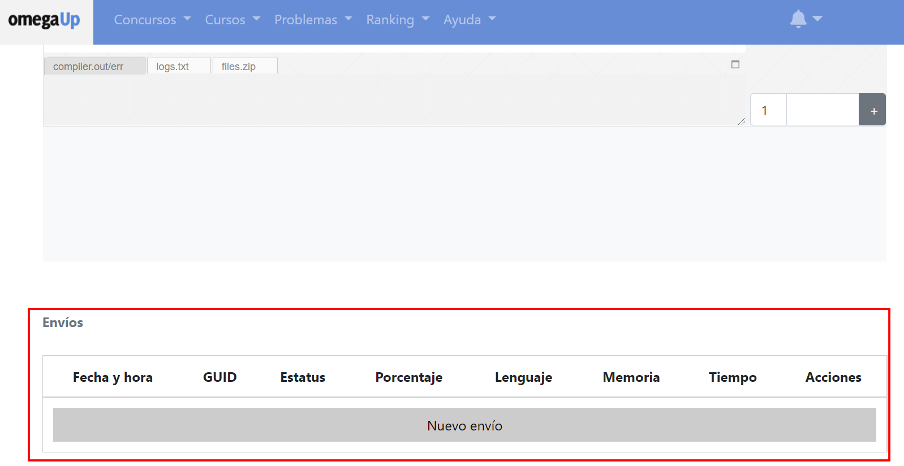
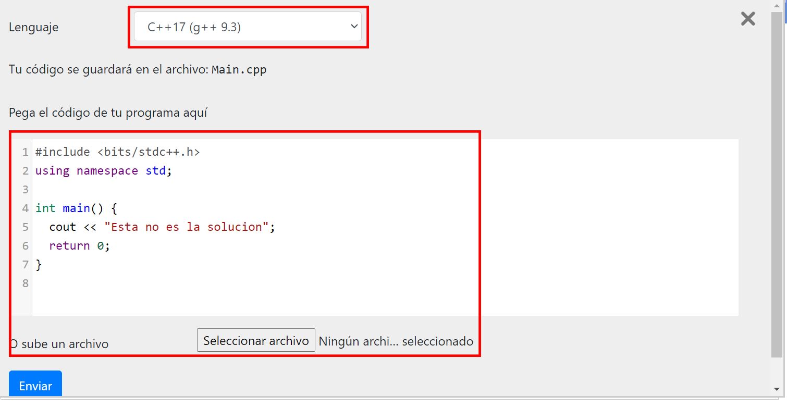
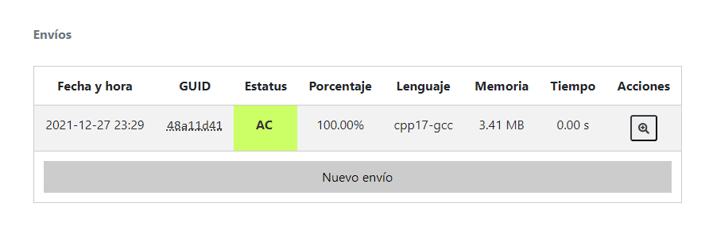

Esta es una **lectura** diseñada para el curso de la OMI Yucatán. El curso tiene como propósito enseñar los principios básicos de programación competitiva en C++.

# OmegaUp: dónde vas a practicar

OmegaUp es la plataforma donde están todos los problemas de este curso. Aquí subes tu código, la plataforma lo prueba automáticamente y te dice si está correcto o no. En lecturas posteriores explicaremos cómo funciona esa evaluación; por ahora aprende a hacer tu primer envío.

## Cómo enviar una solución

**1.** Busca el problema que quieres resolver. Para practicar, abre el primer problema de la sección **Lecciones** de este módulo en el curso.

**2.** Entra al problema y baja hasta la sección de envíos. Da clic en "Nuevo envío".

**3.** Pega tu código en el recuadro (o carga el archivo `.cpp` directamente).

**4.** Selecciona **C++** como lenguaje. La versión exacta no importa por ahora.

**5.** Da clic en enviar. Si tu solución es correcta, el envío aparecerá en **verde** con 100 puntos. Puede tardar unos segundos; si no cambia, refresca la página.

## Lo que viene

Por ahora el objetivo es que te familiarices con la plataforma. En la lectura **Evaluación en OmegaUp** verás en detalle cómo la plataforma decide si tu código está bien o mal, y los errores más comunes que hacen fallar una solución correcta.
