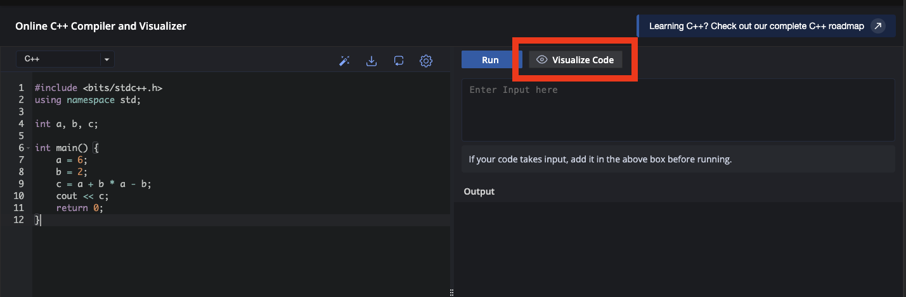
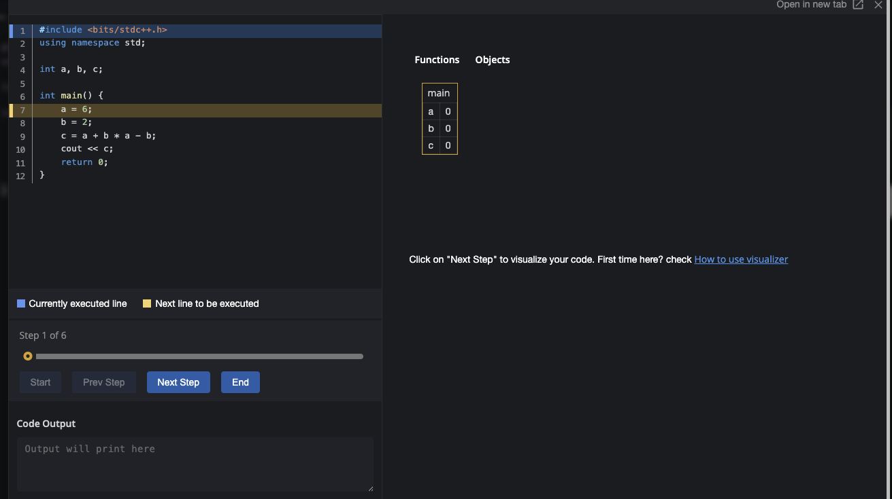

Esta es una **lectura** diseñada para el curso de la OMI Yucatán. El curso tiene como propósito enseñar los principios básicos de programación competitiva en C++.

> **Nota:** Esta lectura aplica únicamente a **CodeChef** (`codechef.com/cpp-online-compiler`). Los otros editores del curso no tienen esta función.

# Debugger: ve tu código paso a paso

El **debugger** (o visualizador paso a paso) de CodeChef te permite ver exactamente lo que hace tu código: línea por línea, observando cómo cambia el valor de cada variable en cada momento. Muy útil cuando algo no da el resultado que esperabas.

Copia este código en CodeChef y tenlo listo — lo vamos a correr con el debugger:

```cpp
#include <bits/stdc++.h>
using namespace std;

int a, b, c;

int main() {
    a = 6;
    b = 2;
    c = a + b * a - b;
    cout << c;
    return 0;
}
```

## Cómo activarlo

En lugar de dar clic en **Run**, busca el botón de **Visualize** (o similar).



Se abrirá una vista especial donde puedes avanzar línea por línea con el botón de **Next Step**.



## Qué observar

Avanza paso a paso y fíjate en los valores de las variables:

- Cuando ejecutas `a = 6`: la variable `a` cambia de `0` a `6`.
- Cuando ejecutas `b = 2`: la variable `b` cambia de `0` a `2`.
- Cuando ejecutas `c = a + b * a - b`: puedes ver el valor final que queda en `c` — en este caso `16`, porque primero se multiplica `b * a = 12`, luego `6 + 12 - 2 = 16`.

Esto es especialmente útil cuando tienes dudas sobre la jerarquía de operaciones — en lugar de calcular en papel, puedes ver el resultado directamente.

## Cuándo usarlo

Úsalo cuando:
- Tu programa da un resultado que no esperabas y no entiendes por qué.
- Quieres verificar que las operaciones se están haciendo en el orden correcto.
- Estás aprendiendo un concepto nuevo y quieres ver exactamente cómo funciona.

No tienes que usarlo siempre — para programas simples es más rápido correr y leer la salida directamente. Pero cuando algo falla, el visualizador es tu mejor herramienta para encontrar el problema.
