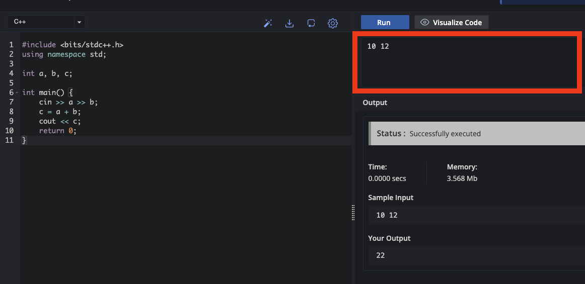
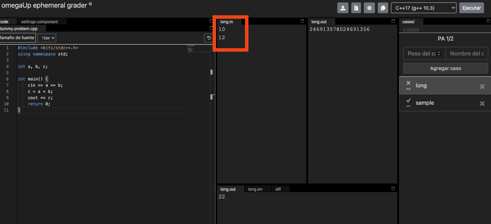
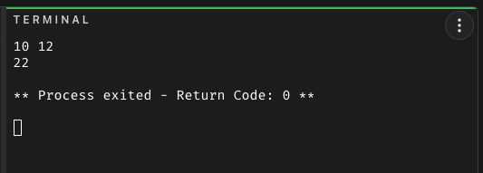

Esta es una **lectura** diseñada para el curso de la OMI Yucatán. El curso tiene como propósito enseñar los principios básicos de programación competitiva en C++.

# Leer Datos: programas que sí son generales

Todos tus programas hasta ahora tienen los números escritos directamente en el código. Si quieres sumar $123 + 812$ en lugar de $4893 + 832$, tienes que abrir el código y cambiarlo. Eso no es práctico — y en OmegaUp es imposible, porque el evaluador es quien le da los números a tu programa.

La solución es **leer los datos desde la entrada** con `cin`.

## Sintaxis del cin

```cpp
cin >> a;        // lee un número y lo guarda en a
cin >> a >> b;   // lee dos números seguidos
```

Los valores pueden estar separados por espacios o por enters; `cin` los interpreta igual en ambos casos.

## Ejemplo: sumar dos números

```cpp
#include <bits/stdc++.h>
using namespace std;

int a, b, c;

int main() {
    cin >> a >> b;
    c = a + b;
    cout << c;
    return 0;
}
```

Pruébalo en tu editor. Cuando lo corras, el programa va a esperar que le des dos números — cómo hacerlo depende de tu editor:

### CodeChef & OmegaUp

**Antes de correr tu código** deberás introducir los números de entrada en el espacio designado para los datos de entrada.




### CodeBlocks & online-cpp.com

**Después de correr tu código** te aparecerá una pantalla negra — la terminal. Estará esperando a que tú introduzcas los datos. Escribe los dos números y presiona Enter.



### Casos de prueba

Por ejemplo, si ingresas `4893 832`, el programa debe imprimir `5725`.

||input
4893 832
||output
5725
||input
123 812
||output
935
||input
0 0
||output
0
||end

El mismo código funciona para cualquier par de números sin modificar el código.

## Ejemplo 2: mensaje personalizado

```cpp
#include <bits/stdc++.h>
using namespace std;

int a;

int main() {
    cin >> a;
    cout << "Has vivido " << a << " anios";
    return 0;
}
```

||input
17
||output
Has vivido 17 anios
||end

Recuerda: no puedes usar la ñ ni acentos en el texto que imprimes en OmegaUp.
