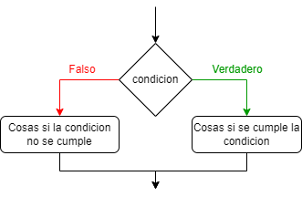
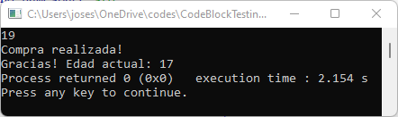

Esta es una **lectura** diseñada para el curso de la OMI Yucatán. El curso tiene como propósito enseñar los principios básicos de programación competitiva en C++.

Fecha de creación: 2 de abril de 2025.

# Else

Pareciera que nuestro problema anterior no tiene solución sencilla y debemos crear una variable nueva. Para nuestra suerte, en programación tenemos el `else`. Este comando justamente nos sirve para manejar lo que sucede con el código cuando la condición no se cumple. Es decir, podemos lograr tener un código con un flujo como el deseado anteriormente en lugar de usar esos trucos baratos.

Un `else` **siempre debe ir acompañado de un** `if` ya que el `if` es quien dice la condición que se va a verificar. La sintaxis del `else` es la siguiente

```cpp
if (condicion) {
    // Cosas si se cumple la condicion
} else {
    // Cosas si la condicion no se cumple
}
```

Y en este caso tenemos un diagrama de flujo como el que queríamos anteriormente.



Por lo tanto, podemos crear un código como el siguiente para probarlo.

```cpp
#include <bits/stdc++.h>
using namespace std;

int a;

int main() {
    cin >> a;

    if (a >= 18) {
        cout << "Compra realizada!\n";
        a -= 2;
    } else {
        cout << "No se pudo realizar la compra porque eres menor de edad\n";
    }

    cout << "Gracias! Edad actual: " << a;
    return 0;
}
```

Y si lo corremos podemos ver que esta vez ya no imprime el mensaje del menor de edad al introducir 19 a pesar de que la edad actual sea 17 después.

