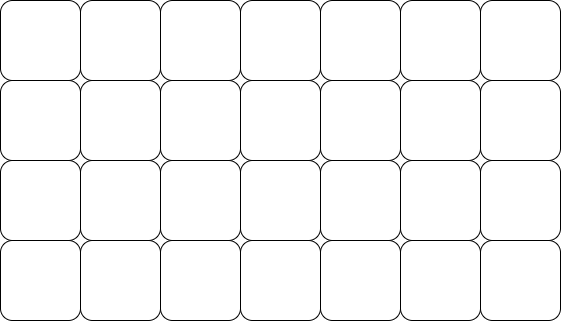
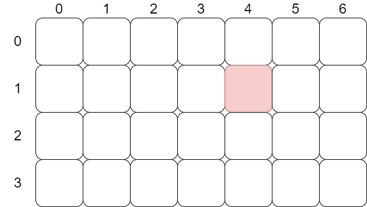

*Este problema es una* ***lección*** *diseñada para el curso de la OMI Yucatán. El curso tiene como propósito enseñar los principios básicos de programación competitiva en C++.*

Fecha de creación: 31 de octubre de 2022.

# Dos dimensiones

Cuando manejamos arreglos estamos en una dimensión. Es decir, estamos pensando en una línea de variables. Sin embargo, existen lugares donde necesitamos manejar herramientas en dos dimensiones. Por ejemplo, la pantalla de una computadora es un espacio de dos dimensiones con ciertos pixeles a lo largo de la altura y anchura.

Ahora imagina el siguiente problema. Se te darán $N$ y $M$ que son las altura y anchura en pixeles de una pantalla. Seguido se te dará un valor entero que indica el color de cada píxel. El usuario quiere invertir horizontalmente la pantalla. Debes dar como salida como quedaría la pantalla invertida.

||input
4 5
1 2 2 8 2
4 7 3 5 2
9 4 2 8 2
8 4 3 0 1
||output
2 8 2 2 1
2 5 3 7 4
2 8 2 4 9
1 0 3 4 8
||end

Si nos damos cuenta el problema se puede reducir a imprimir en orden inverso cada línea que nos dan. Como ya vimos antes podemos procesar cada línea por separado y esto el evaluador lo tomara como correcto. Sin embargo, haremos uso de una nueva herramienta para ver su potencial.

# Matrices

Las matrices las podemos ver como un arreglo de arreglos. Como mencionamos antes, este es el salto para pasar de una dimensión a dos dimensiones. En lugar de tener una línea de datos vamos a tener un rectángulo de ellos. 



Ahora cada dato, en lugar de estar representado por un único número que antes era la posición, tendremos $2$ números la fila y columna en donde se encuentra. La forma de enumerar filas y columnas en programación suele ser de arriba hacia abajo y de izquierda a derecha.



El dato pintado de rojo tiene la posición $(1, 4)$. Es decir, primero se pone la fila en la que se encuentra y después la columna.

La forma de declarar una matriz es la misma que un arreglo, pero en lugar de una dimensión le agregamos otra con otros corchetes.

```cpp
tipo_de_dato nombre[filas][columnas];
```

Por ejemplo, para declarar una matriz como la de la imagen seria.

```cpp
int santy[4][7];
```

Para usar las variables dentro de la matriz ahora usamos dos variables que indican la fila y columna de cada variable.

```cpp
cin >> santy[0][4];
santy[1][2] = santy[0][1] * santy[2][1] + santy[1][4] * santy[3][0];
cout << santy[1][2];
```

# Leyendo una matriz

Para leer una matriz tendremos que hacer uso de ciclos anidados. Necesitamos un primer ciclo que itere sobre las filas.

```cpp
for (int i = 0; i < 4; i++)
```

Luego para cada línea hay que leer las columnas. Esto lo podemos hacer como hemos leído los arreglos hasta ahora.

```cpp
for (int i = 0; i < 4; i++) {
    for (int j = 0; j < 7; j++) {
        cin >> santy[i][j];
    }
}
```

Nota que la forma en la que leemos los datos coincide justamente con cómo lo interpretamos. Típicamente para una matriz de dimensiones $N$ y $M$ esto se ve como

```cpp
for (int i = 0; i < N; i++) {
    for (int j = 0; j < M; j++) {
        cin >> santy[i][j];
    }
}
```

Para imprimir una matriz es solo modificar ese ciclo con los cambios correspondientes.

# Invertir horizontalmente la matriz

Ya tenemos las bases para implementar nuestro código inicial que lea la matriz del problema propuesto al principio

```cpp
#include <bits/stdc++.h>
using namespace std;

int N, M;
int mat[100][100];

int main() {
    ios_base::sync_with_stdio(0); cin.tie(0);
    cin >> N >> M;

    for (int i = 0; i < N; i++) {
        for (int j = 0; j < M; j++) {
            cin >> mat[i][j];
        }
    }

    return 0;
}
```

Solo nos falta la parte de invertir la matriz. Para esto usaremos la misma idea que en la lección anterior. Solo que en esta ocasión cada una de las filas va a ser invertida.

```cpp
#include <bits/stdc++.h>
using namespace std;

int N, M;
int mat[100][100];

int main() {
    ios_base::sync_with_stdio(0); cin.tie(0);
    cin >> N >> M;

    for (int i = 0; i < N; i++) {
        for (int j = 0; j < M; j++) {
            cin >> mat[i][j];
        }
    }

    for (int i = 0; i < N; i++) {
        // Este es ciclo que invertimos
        for (int j = M - 1; j >= 0; j--) {
            cout << mat[i][j] << " ";
        }
        cout << '\n';
    }

    return 0;
}
```

# Limites

Ya mencionamos que un arreglo tiene como límite $10^6$ (algo asi). Uno naturalmente, al tratarse de un arreglo de arreglos podríamos tener algo como `int mat[100000][100000];`. Lamentablemente esto no es cierto. Las limitaciones de un arreglo surgen de una limitación de memoria en la computadora. 

Por lo tanto, la verdadera limitación es la cantidad de variables que podemos almacenar. En la matriz anterior tendríamos un total de $100000 \times 100000$ variables. Entonces, la verdad es que la cantidad de variables no puede pasarse del límite que tienen los arreglos. Es decir, si tenemos un matriz de $N$ filas y $M$ columnas entonces $N \times M \leq 10^6$.

---

# Problema

 Se te darán $N$ y $M$ que son las altura y anchura en pixeles de una pantalla. Seguido se te dará un valor entero que indica el color de cada píxel. El usuario quiere invertir **verticalmente** la pantalla. Debes dar como salida como quedaría la pantalla invertida.

||input
4 5
1 2 2 8 2
4 7 3 5 2
9 4 2 8 2
8 4 3 0 1
||output
8 4 3 0 1
9 4 2 8 2
4 7 3 5 2
1 2 2 8 2
||input
2 1
5
4
||output
4
5
||end

# Limites 

- $0 < N, M \leq 10$
- $0 \leq p_{i, j} < 10$