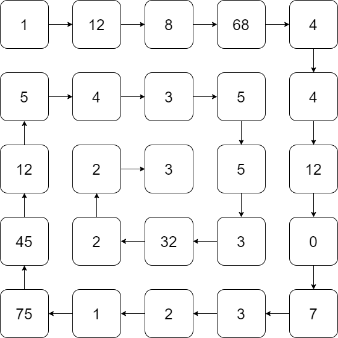
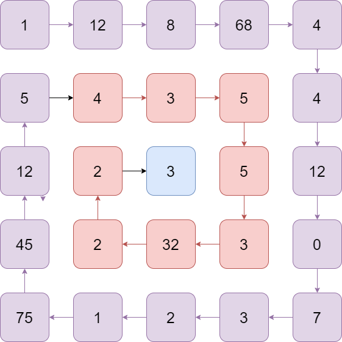
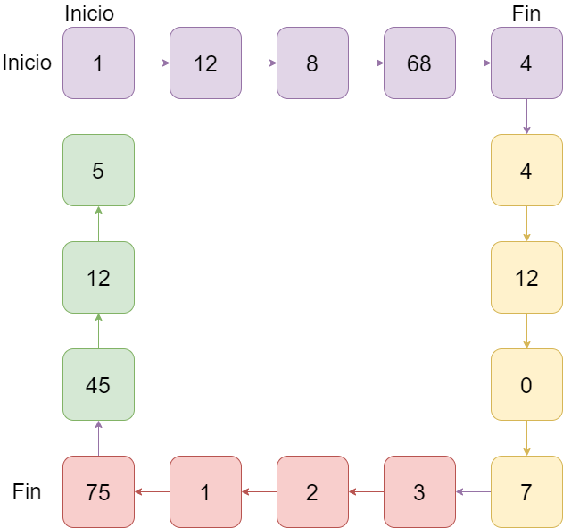

*Este problema es una* ***lección*** *diseñada para el curso de la OMI Yucatán. El curso tiene como propósito enseñar los principios básicos de programación competitiva en C++.*

Fecha de creación: 31 de octubre de 2022.

No fue fácil la elección del problema con matrices que resolveríamos juntos. Al final elegí este problema porque quizá es uno de los más complicados al momento de aprender matrices. Podríamos decir que una persona capaz de resolver este problema sin ayuda ya tiene el tema dominado. Ya que por el momento lo único que hacemos con el arreglo y las matrices son recorrerlos en ciertas formas.

Se elegio un problema complicado para que el alumno pueda entender mejor de donde salen las ideas y sea capaz de comprenderlo en caso de que no pudiera dar con la respuesta por el mismo

# Problema

Se te dara una matriz de $N \times N$. Deberas imprimir el orden en espiral de la matriz.



# Entrada 

Un entero $N$ indicando la dimension de la matriz. Seguido una matriz de $N \times N$ numeros.

# Salida

Una linea de $N \times N$ numeros que es el recorrido en espiral de la matriz.

||input
5
1 12 8 68 4
5 4 3 5 4
12 2 3 5 12
45 2 32 3 0
75 1 2 3 7
||output
1 12 8 68 4 4 12 0 7 3 2 1 75 45 12 5
||input
4
1 2 3 4
5 6 7 8
9 10 11 12
13 14 15 16
||output
1 2 3 4 8 12 16 15 14 13 9 5 6 7 11 10s
||end

# Limites

- $0 < N \leq 15$
- $0 \leq a_{i, j} < 100$

---

# Solucion

Una de claves para resolver problemas de ciclos es encontrar patrones. Es decir, que cosas se parecen o podemos repetir en la solucion que nos haga mas facil el problema. 

Notemos que podemos ver el recorrido en espiral "por capas". Pintemos el ejemplo para ver de lo que estoy hablando.



Nota que primero recorremos la capa exterior que es la morada. Una vez hacemos eso, debemos hacer *lo mismo* pero ahora en la siguiente capa (la roja) y así sucesivamente hasta que no haya más capas. Entonces, si logramos buscar una forma de recorrer capas pues solo debemos hacer un ciclo que vaya capa por capa y lo habremos resuelto.

En vez de pensar en general, muchas veces nos sirve pensar en objetivos específicos. Por ejemplo, en lugar de pensar como rayos vamos a imprimir cada capa en general, empecemos pensando ¿Como imprimimos la primera capa?

Nota que recorrer la primera capa es recorrer los bordes. Eso lo podemos hacer con cuatro ciclos, uno que recorra la parte superior, otro la lateral derecha, la parte inferior y otra la lateral derecha.

```cpp
for (int i = 0; i < N; i++) {
    cout << mat[0][i] << " ";
}

for (int i = 1; i < N; i++) {
    cout << mat[i][N - 1] << " ";
}

for (int i = N - 2; i >= 0; i--) {
    cout << mat[N - 1][i] << " ";
}

for (int i = N - 2; i >= 1; i--) {
    cout << mat[i][0] << " ";
}
```

Nota que dejamos fija una posición y lo demás lo recorremos con el ciclo, de esta forma logramos recorrer la primera capa de la espiral. Muy bien, ahora toca ver cómo hacer lo mismo pero las demás capaz. Debemos idearnos una forma de poder poner eso dentro de un ciclo para que se haga para cada capa.

Notemos que cada capa en realidad tiene un inicio y un final. Por ejemplo, la primera capa tiene como inicio la posición $0$ y va hasta la posición $N - 1$. Luego la segunda capa va desde $1$ hasta $N-2$. y así sucesivamente. Entonces, podemos modificar ligeramente el código anterior para en vez de actuar con $0$ y $N-1$, actúe con dos variables inicio y fin.

```cpp
int inicio, fin;

for (int i = inicio; i <= fin; i++) {
    cout << mat[inicio][i] << " ";
}

for (int i = inicio + 1; i <= fin; i++) {
    cout << mat[i][fin] << " ";
}

for (int i = fin - 1; i >= inicio; i--) {
    cout << mat[fin][i] << " ";
}

for (int i = fin - 1; i >= inicio + 1; i--) {
    cout << mat[i][inicio] << " ";
}
```

Nota como cada uno de los ciclos está recorriendo cada uno de los siguientes colores.



Entonces vamos a estar haciendo esto y al final para pasar a la siguiente capa solo debemos incrementar el inicio por 1 y el final decrementarlo. Entonces el código tendría la siguiente forma

```cpp
inicio = 0;
fin = N - 1;
while (condicion) {
    for (int i = inicio; i <= fin; i++) {
        cout << mat[inicio][i] << " ";
    }

    for (int i = inicio + 1; i <= fin; i++) {
        cout << mat[i][fin] << " ";
    }

    for (int i = fin - 1; i >= inicio; i--) {
        cout << mat[fin][i] << " ";
    }

    for (int i = fin - 1; i >= inicio + 1; i--) {
        cout << mat[i][inicio] << " ";
    }

    inicio++;
    fin--;
}
```

Ahora solo nos queda descifrar que condición va en nuestro while. Veamos esto en un ejemplo. Imaginemos que tenemos una matriz de $5 \times 5$. En cada capa ocurre lo siguiente:

- Capa 1. Inicio = 0, Fin = 4.
- Capa 2. Inicio = 1, Fin = 3.
- Capa 3. Inicio = 2, Fin = 2.

Y ya únicamente tenemos tres capas. Entonces una condición para estar repitiendo esto es mientras `Inicio <= Fin`. Cuando suceda que el inicio sobrepasa al final pues ya no tenemos más capas por imprimir. Por lo tanto, el código completo quedaría como sigue

```cpp
#include <bits/stdc++.h>
using namespace std;

int N, inicio, fin;
int mat[15][15];

int main() {
    ios_base::sync_with_stdio(0); cin.tie(0);
    cin >> N;

    for (int i = 0; i < N; i++) {
        for (int j = 0; j < N; j++) {
            cin >> mat[i][j];
        }
    }


    inicio = 0;
    fin = N-1;

    while (inicio <= fin) {
        for (int i = inicio; i <= fin; i++) {
            cout << mat[inicio][i] << " ";
        }

        for (int i = inicio + 1; i <= fin; i++) {
            cout << mat[i][fin] << " ";
        }

        for (int i = fin - 1; i >= inicio; i--) {
            cout << mat[fin][i] << " ";
        }

        for (int i = fin - 1; i >= inicio + 1; i--) {
            cout << mat[i][inicio] << " ";
        }

        inicio++;
        fin--;
    }
    
    return 0;
}
```
