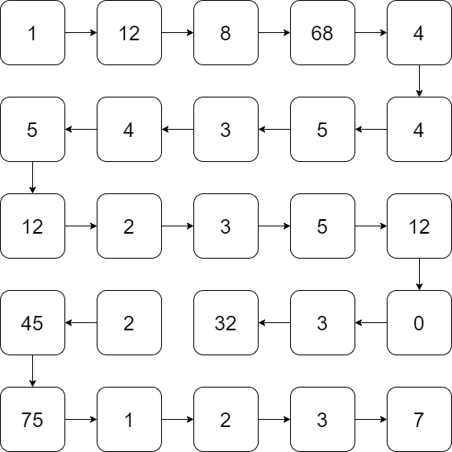

*Este problema es una* ***tarea*** *diseñada para el curso de la OMI Yucatán. El curso tiene como propósito enseñar los principios básicos de programación competitiva en C++.*

Fecha de creación: 7 de noviembre de 2022.

# Problema

Se te dará una matriz de $N \times M$. Deberás imprimir la matriz en orden *serpentino*. Este orden consiste en ir fila por fila e intercalar entre imprimirla de izquierda a derecha y viceversa.

# Entrada

Dos enteros $N$ y $M$ representando las dimensiones de la matriz. En las siguientes líneas se darán los elementos $a_{i, j}$ de la matriz.

# Salida

Una línea de $N \times M$ enteros que es el orden serpentino de la matriz.

# Ejemplos

||input
3 4
1 2 3 4
5 6 7 8
9 10 11 12
||output
1 2 3 4 8 7 6 5 9 10 11 12
||input
2 2
100 45
883 983
||output
100 45 983 883
||end

# Limites

- $1 \leq N, M \leq 10^3$.
- $1 \leq a_{i, j} \leq 10^4$.