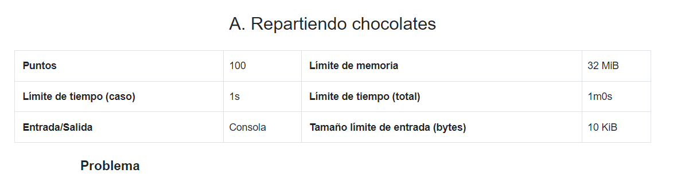

**Este problema es una lección diseñada para el curso de la OMI Yucatán. El curso tiene como propósito enseñar los principios básicos de programación competitiva en C++.**

Fecha de creación: 2 de noviembre de 2023.

# Medir Eficiencia

El **análisis de complejidad** es un tema muy importante en el ámbito de la programación competitiva. Si nos damos cuenta, en los problemas tenemos un límite de tiempo establecido, que suele ser un segundo, y un límite de memoria.



Pero, ¿cómo rayos vamos a medir cuánto tiempo y memoria nos toma nuestro programa? Por el momento, enfoquémonos en el tiempo, que es lo más complicado. El tiempo que tarda en ejecutarse un programa depende de muchos factores, como la máquina en la que lo corremos, los procesos adicionales que se estén haciendo, las operaciones que hace el código, el tiempo de cada operación, etc.

Obviamente, no podemos medir el tiempo que se tomará nuestro programa con exactitud, sin embargo, podemos dar una idea bastante buena. El análisis de complejidad se refiere justamente a eso, intentar darnos una idea de cuánto se tardará nuestro código basado en la implementación que hagamos. Más aún, vamos a poder darnos una idea **sin tener que conocer los detalles de la implementación**. Es decir, vamos a poder decir si una solución entra en el tiempo que nos dan sin siquiera tener que programarla. Parece magia y suena muy complicado, pero en esta lección veremos lo sencillo que puede llegar a ser eso.

# Crecimiento de las funciones

Imagina que nos presentan los siguientes 3 códigos.

```cpp
cin >> N;
N += 2;
cout << N;
```

```cpp
cin >> N;
suma = 0;
for (int i = 0; i < N; i++) {
    suma++;
}
cout << suma;
```

```cpp
cin >> N;
N += 2;
N *= 2;
N++;
N++;
N %= 100;
N++;
N--;
cout << N;
```

Si te dijeran que los ordenes del que tarda menos al que toma más tiempo en ejecutarse, ¿cómo los ordenarías?

Claramente, el primer código sería el que tarda menos, ya que solo hace una suma. Luego, viene un dilema, porque depende del valor de $N$, es cuanto tarda el segundo. Si $N=2$, por decir algo, entonces podemos decir que el segundo tarda menos, pero si $N=1000$ entonces el segundo va a tardar más porque hace más operaciones. Igual hace falta tener en cuenta si la suma tarda más que un módulo o que una comparación o que una asignación.

Ciertamente nos estamos complicando la vida para determinar qué código es más rápido. Para simplificar todo esto, el análisis de complejidad nos dice que **tomaremos todas las operaciones como iguales**. Además, **la cantidad exacta de operaciones no nos importa, simplemente nos interesará cómo crece la cantidad de operaciones con respecto a la entrada**.

Tanto el primer como el tercer código harán la misma cantidad de operaciones si $N = 10$ o $N = 10^5$. En este caso, decimos que el algoritmo es *constante* y se denota como $O(1)$, la O mayúscula es el símbolo que utilizamos para denotar complejidades. Por otro lado, el segundo algoritmo hace una cantidad de operaciones proporcional al número $N$, y en este caso estamos ante un algoritmo *lineal* y se denota como $O(N)$.

# Complejidades sencillas

La mayoría de códigos que hagamos por ahora suelen tener complejidades bastante comunes y, por lo tanto, sencillas de calcular. Aquí presentamos algunos algoritmos bastante sencillos y sus complejidades.

## Constante

Cuando hagamos códigos que solo involucran hacer un número fijo de operaciones, estos algoritmos se denominan como constantes y en términos de complejidad son $O(1)$. Por ejemplo,

```cpp
cin >> a >> b;
c = a + b;
cout << c;
```

```cpp
cin >> a >> b;
if (b > 2) {
    if (a % 2 == 0) {
        cout << "Cosa 1";
    }
} else {
    if (a % 2 == 0) {
        cout << "Cosa 2";
    } else {
        cout << "Cosa 3";
    }
}
```

## Lineal

Cuando tenemos un ciclo que hace una cantidad de operaciones fijas $N$ veces, decimos que este algoritmo es lineal y en términos de complejidad es $O(N)$. En la mayoría de los casos, esto es causado por un ciclo que se está repitiendo $N$ veces.

```cpp
cin >> N;
for (int i = 0; i < N; i++) {
    cout << "Hola\n";
}
```

```cpp
cin >> N;
suma = 0
for (int i = 0; i < N; i++) {
    suma += i % 2;
}
cout << suma;
```

## Cuadrático

Cuando tenemos una cantidad de operaciones fijas que se repiten $N^2$ veces, decimos que el algoritmo es cuadrático. En términos de complejidad, esto es $O(N^2)$. Esto sucede mayormente cuando tenemos dos ciclos anidados que se repiten $N$ veces.

```cpp
cin >> N;
suma = 0
for (int i = 0; i < N; i++) {
    for (int j = 0; j < N; j++) {
        suma += i * j;
    }
}
cout << suma;
```

```cpp
cin >> N;
suma = 0
for (int i = 0; i < N * N; i++) {
    if (i % 2 == 0) {
        suma += 5;
    } else {
        suma -= 3;
    }
}
cout << suma;
```

## Logarítmico

Una complejidad que nos vamos a encontrar muchas veces es la logarítmica. Imagina que nos piden saber cuántos dígitos tiene un número. Nosotros podríamos hacer un código que calcule eso simplemente dividiendo entre 10 hasta que el número sea 0.

```cpp
cin >> a;
con = 0;
while (a > 0) {
    a /= 10;
    con++;
}


cout << con;
```

Justamente el resultado de esto es el logaritmo base 10 del número (redondeado hacia abajo), que se suele expresar como $\log (a)$. En realidad, el logaritmo se define como la operación inversa del exponente. Es decir,

$$
    10^x = a \quad \leftrightarrow \quad x = \log a
$$

Cuando la operación se hace con otro número se cambia la base y se le pone un subíndice en el logaritmo. Por ejemplo, si lo queremos base 7, sería

$$
    7^x = a \quad \leftrightarrow \quad x = \log_7 a
$$

En el caso de informática, en realidad cuando decimos $\log$ nos referimos al logaritmo base 2 ($\log_2$) ya que es lo más usado en nuestro ámbito debido a su propia naturaleza. Entonces, un algoritmo que tarde "la cantidad de veces que tome dividir entre 2 a $N$" se dice que es logarítmico. En términos de complejidad, esto sería $O(\log N)$.

```cpp
cin >> a;
con = 0;
while (a > 0) {
    a /= 2;
    con++;
}
cout << con;
```